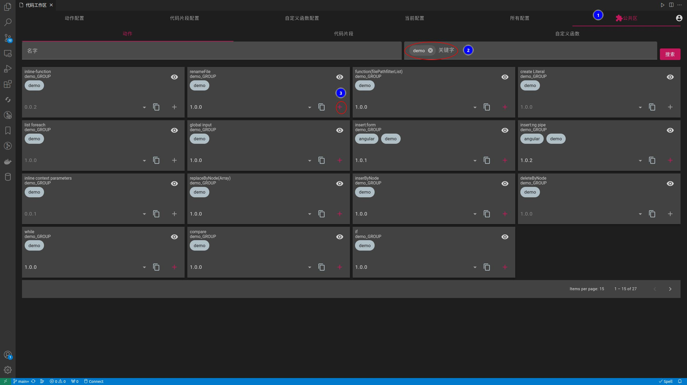

## Code Recycle
> 一个模板处理与可编程逻辑设计器

## 概述

用于快速初始化项目;代码重构;动态代码片段;
减少开发中的重复性逻辑

> **什么是重复性逻辑?**  
> 如果某些操作不需要进行考虑,只需要按照一定规则进行处理,那么就可以视为`重复性逻辑`

## 特性
- 模板快速裁剪与自由组合
- 模板冲突交互处理
- 模板生成后可以撤销
- 语言无关,框架无关,只要支持语法解析即可
- css语法查询,支持400+种的语法解析
- 抽象语法树的语法查询调试
- 自定义规则的图灵完备
- 自定义规则的视图化设计
- 自定义规则的视图化操作
- 
## 快速体验
- 你可以安装插件登录后,进入公共区找到带`demo`标签的公开实例快速了解

