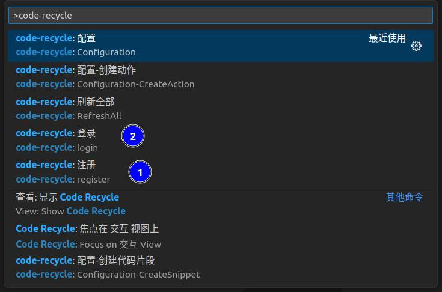

## 登录
需要先登录才能使用本拓展的所有功能
  > 打开命令面板(右键)
  > 如果没有帐号需要先注册. 命令 `code-recycle:register`  
  > 登录. 命令 `code-recycle:login`

?> 由于拓展的部分功能比较复杂,所以在使用过程中可能会使用到其他人已经设计好的资源,因此需要帐号登录

?> 拓展的`抽象语法树调试`不需要登录帐号
## 设计
- 模板的裁剪与添加,代码片段,自定义规则的实现均属于设计部分
- 如果您使用其他人公开的资源,那么可以跳过这一步

## 调用
功能的执行可以通过以下几种方式
- 代码片段直接使用
> 普通的代码片段与vscode完全一样
> 动态代码片段需要根据定义的片段输入不同参数进行执行
- 在`资源管理器`活动栏下,选择某个文件或某个文件夹右键执行
> 具体位置根据你要执行的`动作`内规定的确定

