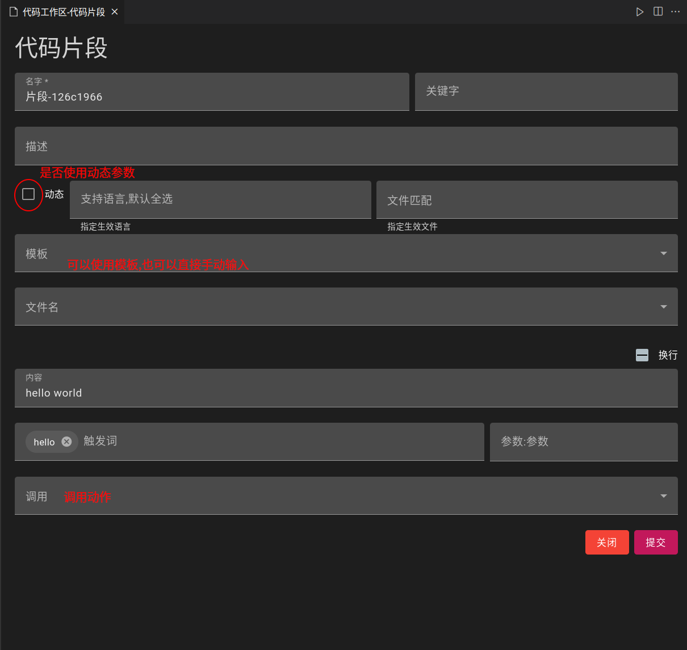

## 代码片段

- 打开命令面板,输入`code-recycle.create-snippet`
> 或输入`code-recycle.code-recycle`然后在代码片段配置中添加

### 作为静态代码片段

- 目前与`VSCode`中的功能一致,只不过多了一个页面配置

### 作为动态代码片段

- 触发词作为前缀词,需要前缀部分或完全匹配
- 正则表达式匹配参数
> 默认的`([\p{L}\p{N}]+)`表示匹配一个由字符和数字组成的参数

### 模板传入

- 选择之前处理好的某个文件,会自动的将`替换变量`转换为代码片段中的可选值

## 生效语言

- 指定哪些语言下可用

## 生效文件

- 指定那些文件下可用
> [生效文件写法](https://code.visualstudio.com/docs/editor/glob-patterns)  
> `生效语言`和`生效文件`可以一起设置

## 调用

- 静态/动态代码片段均可以调用`动作`;也就是在完成代码片段补全后,会执行选中`动作`,由`动作`进行接下来的处理

## 默认参数

- 接受一个json对象,用来传入到代码片段中
> 如果多个代码片段调用一个动作,但是又需要有所区分,就可以使用它
- 此参数会被动态代码片段中的同名参数覆盖
> 如果正则中有使用`(?<Name>x)`[具名捕获组](https://developer.mozilla.org/zh-CN/docs/Web/JavaScript/Guide/Regular_expressions/Groups_and_backreferences)匹配
