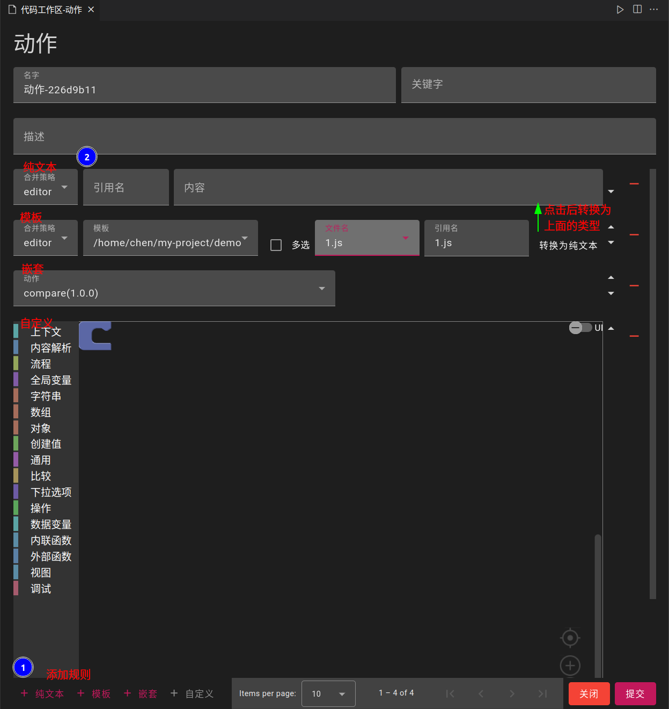

## 创建动作
- 打开命令面板,输入`code-recycle.create-action`
> 或输入`code-recycle.code-recycle`然后在动作配置中添加

## 模板规则
- 选择之前处理的文件,修改引用名(支持变量)

### 合并策略
- `override`: 覆盖当前文件
- `default`: 不覆盖当前文件
- `error`: 出现冲突抛异常
- `editor`: 通过编辑器交互处理

### 多选
- 一个模板内选择多个文件.选择后自动生成多条模板规则

### 引用名
- 与之前的替换变量规则一致

### 转为纯文本
- 将引用的修改文件内容转换为一个文件模板
> 也可以在发布时[自动转换](../公开?id=动作模板转换为文本)

## 纯文本规则
- 与模板规则类似,允许自己输入内容
- 无法同步,但是允许自定义修改与发布到公共区

## 嵌套规则
- 调用其他动作

## 自定义规则
- 见[自定义规则](./自定义规则)页面

## 视图化动作
- 见[视图化动作](./自定义规则?id=视图化动作)页面
