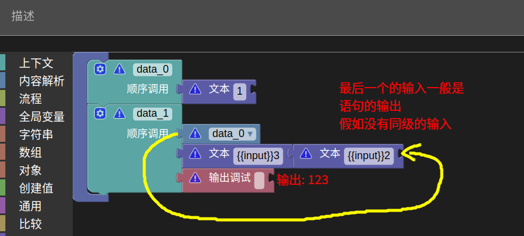
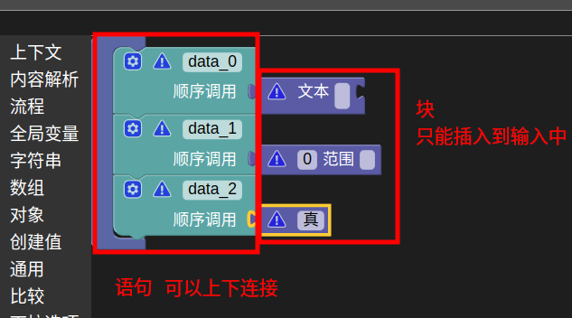
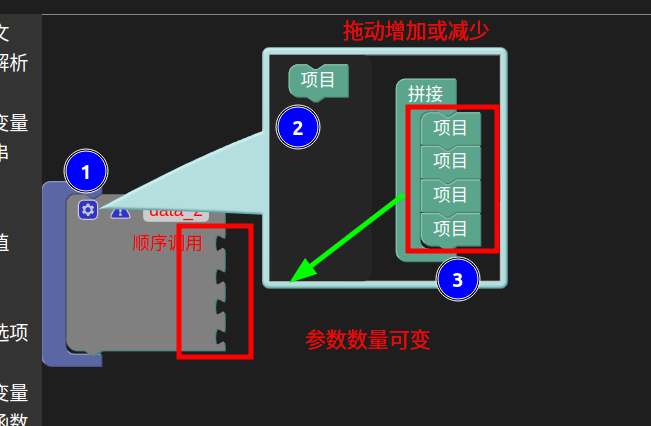
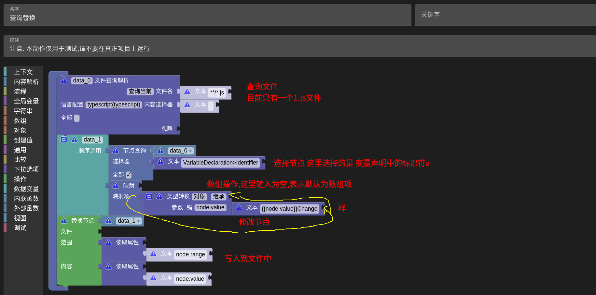
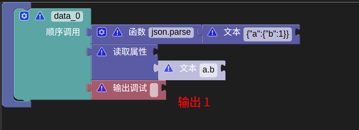
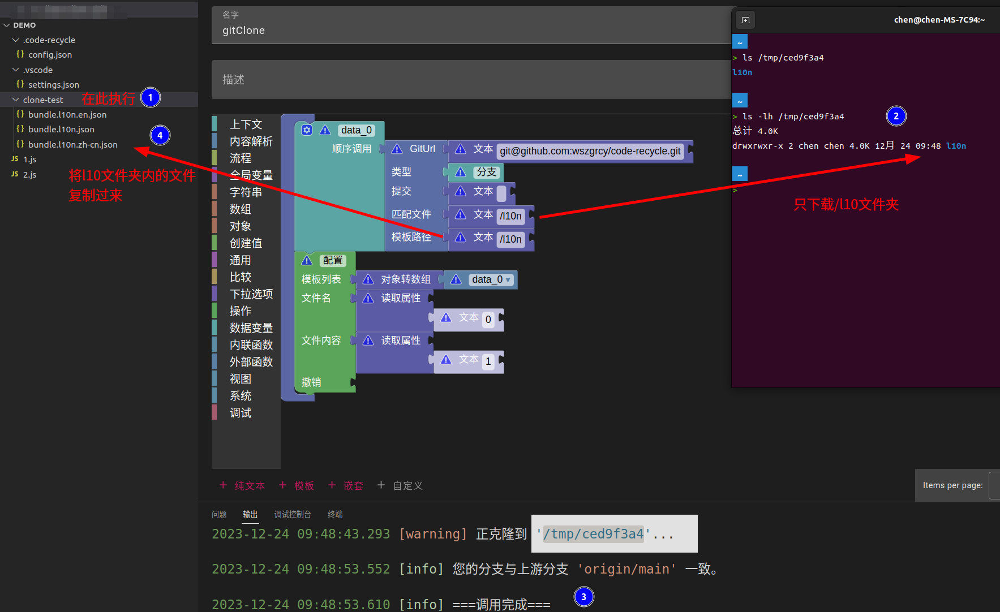
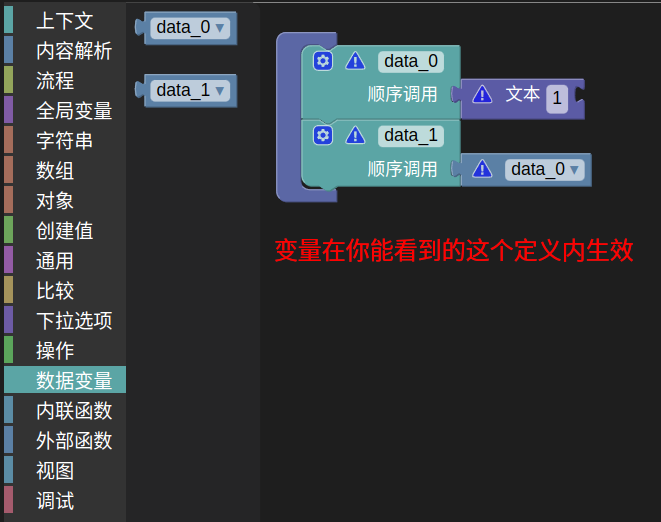
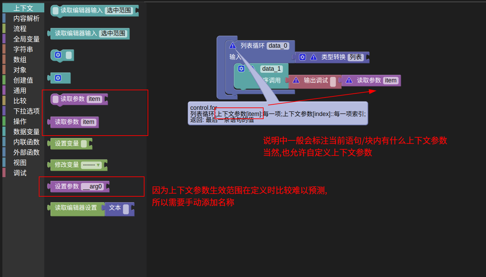
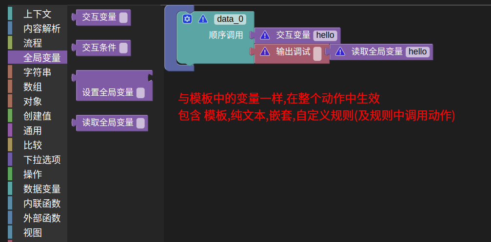

## 自定义规则
- 在动作中创建自定义规则,或自定义函数中创建
- 自定义规则是使用`blocky`进行可视化编辑的

- 语句/块的输入值传递顺序为从右到左,从上到下

- 工作文件夹为选中的文件所在的文件夹或选中的文件夹
> 也就是使用相对路径时,基于此文件夹计算
## 操作提示
- 每一个语句/块上都有说明可以查看

- 有上下关系的可以叫语句;只有输入/输出的叫块

- 选中某一个块后,使用`Ctrl+C`可以复制该块,`Ctrl+V`粘贴
> 支持跨动作复制
- 按住`Alt`可以把拼装好的某个块/语句单独拖拽出来
- 带有`齿轮`图标的为可变参数

## 创建内容解析
- 使用某一个语法解析器,将文本解析,创建内容解析器
- 一共有三类解析方式,分别是:文件查询解析,文件解析,字符串解析

###  文件查询解析
- 通过glob与selector确定要解析的文件,然后将匹配的文件创建解析器

### 文件解析
- 传入路径或者路径数组,返回创建的文件解析器

### 字符串解析
- 将传入的字符串作为内容创建内容解析器
> 此解析器没有文件路径

## 节点查询
- 使用css语法查询返回匹配的节点结果

## 替换节点
- 通过确定的节点,获得范围与内容,修改后传入替换节点语句

## 常用块
- 每一个语句/块上都有说明可以查看
- 如果存在某些细节上不清楚如何使用的可以提[Issue](https://github.com/wszgrcy/code-recycle/issues)

### 读取属性
- 根据传入路径`xx.yy.zz`读取对象/列表的属性

### 类型转换
- `对象`,`继承`: 在某个对象上修改一些属性,返回新的属性
- `对象`,`创建`: 创建一个对象
- `列表`: 创建一个确定长度的数组

### Git模板
- 通过`git clone`拉取仓库指定文件
!> 请不要将账户密码写到Url中

- 使用`git sparse-checkout`拉取,所以只会拉取指定文件使用,速度比正常拉取快一些
- 支持二进制文件应用与撤销
- 目前只作为普通文件进行应用与撤销
> 不支持`{{xx}}`传入变量等写法,会作为普通文件处理
> 可以使用内容选择器修改节点后再替换

#### 演示资源
- `gitClone`
#### 配置
- `code-recycle.action.gitClone.tmpDir`设置临时保存git内容的文件夹,默认为[操作系统临时文件夹](https://nodejs.org/dist/latest-v20.x/docs/api/os.html#ostmpdir)
## 变量
### 自定义规则-定义全局
- 每条语句上的自动初始化的变量名与`数据变量`栏中现实的,都是在这个域中的,大多数情况下可以用这个变量,比较方便
- 如果出现函数/闭包等结构,不建议使用,因为这个相当于规则内的全局变量

### 自定义规则-上下文
- 一般 `if`,`for`,`while`,`函数` 等块/语句会建立一个新的上下文域,并且传递一些内置参数`item`,`index`,`condition`,`input`等
- 新的上下文域会继承之前的上下文
- 该域比较贴近正常代码开发的那种变量生效范围,但是因为上下文变量生效范围不好分析,所以只能手写变量

### 自定义函数-函数参数(自定义函数专有)
- 专门用来定义自定义函数的参数
- 函数参数会在该参数调用时执行获得

### 动作-全局变量
- 在整个动作中生效
- 模板中的变量替换中的变量,和可选中的变量都属于全局变量
- 动作嵌套和自定义规则中调用其他动作,都共享这个变量

---

## 视图化动作
- 动作中只能有一个自定义规则,不能有其他规则
- 与普通的自定义规则相同,但最后一条语句应该是`定义视图`(`view.view`)

### 初始化变量
- 在视图化动作中,请使用`全局变量`进行赋值
- 初始化赋值时请使用`common.or`中`??`
> 视图中的每个值变化都会重新执行一遍动作,所以需要使用`??`保证数据在初始化后不会被重复计算

## 演示资源
- 公共区`自定义规则输出顺序`,`自定义规则输出2`,`查询替换`,`读取属性`,`上下文参数`,`全局变量`,`视图动作`