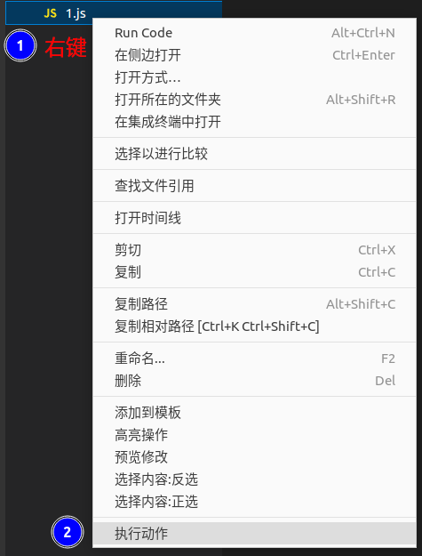
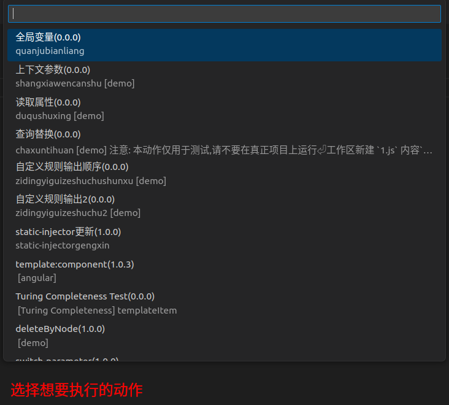
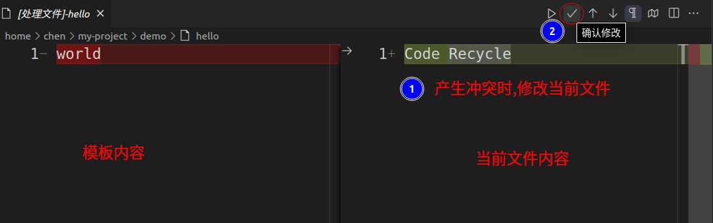
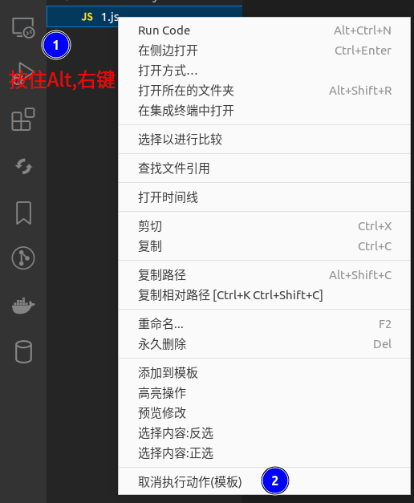
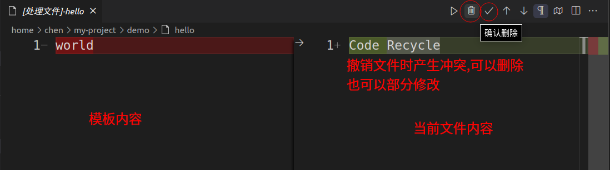
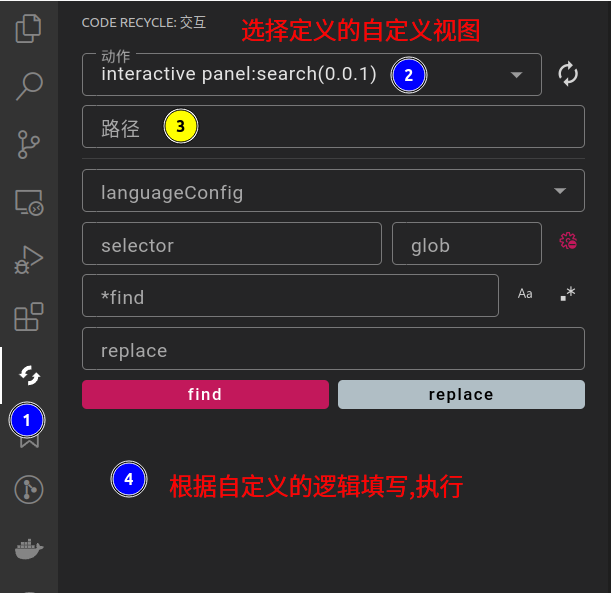

## 调用动作

### 在代码片段中被动调用
- 见[代码片段](./调用代码片段)

### 在文件/文件夹上调用
- 右键`执行动作`

#### 撤销(模板)
- 按住`Alt`键后,右键`取消执行动作`,选择想要撤销的动作
> 只能撤销动作中的模板(纯文本)

- 撤销时会出现diff编辑器,手动操作需要删除的部分

- 设置`code-recycle.cancelAction.skipSame`可以跳过与模板相同的文件,直接删除
### 手动调用
- 命令面板执行命令`code-recycle.callActionByFile`
- 相当于在当前激活的文本编辑器上调用

### 配置
- `code-recycle.action.dryRun` 设置为`true`执行结果会输出到`code-recycle`频道而不是写入文件
- `code-recycle.log.ruleCall` 设置为`true`会输出执行顺序

## 视图动作
- `Code Recycle`活动栏执行`视图化动作`

