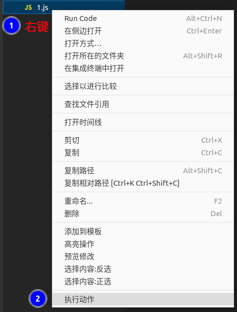

## Call Action

### Passive Call in Code Snippet
- See [Code Snippet](./call-snippet)

### Call in File/Directory
- Right-click and select `Call Action`

#### Revoke (Template)
- Hold down `Alt` key and right-click `Cancel Call Action(Only Template)`, select the action to be aborted
> Can only abort the template (pure text) in the action

- Will appear the diff editor when aborted, manual operation is needed to delete the affected parts

- Setting `code-recycle.cancelAction.skipSame` can skip over files that have the same template and directly delete

### Manually Call
- Execute command `code-recycle.callActionByFile` in the command panel
- Equivalent to calling the action in the currently active text editor

### Configuration
- Set `code-recycle.action.dryRun` to `true` to output the result to the `code-recycle` channel instead of writing to the file
- Set `code-recycle.log.ruleCall` to `true` to output the execution order

---

## Visual Action

- `Code Recycle` activity bar executes `Visual action`

