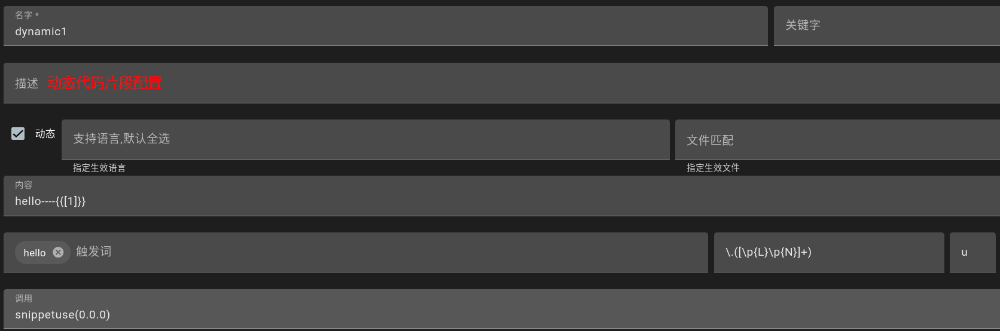
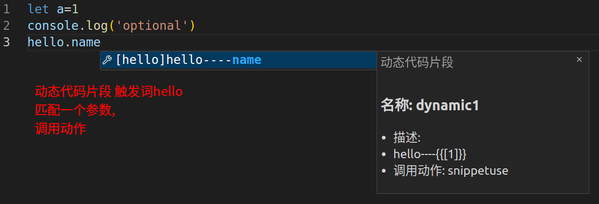

## Callback Snippet

- Automatically take effect after adding code snippets

## Dynamic Placeholder
- When using dynamic snippets, since regex matching cannot predict, if the prefix word is matched after the input process parameter is not completely inputted and no snippets are matched, Dynamic Placeholder will appear. Dynamic Placeholder does not perform any operations, and when the input is completed, the matched snippets will display normally as placeholders.

## Configuration

- `code-recycle.snippet.triggerCharacters` Some trigger words for the callback snippet, the default is `['.']`