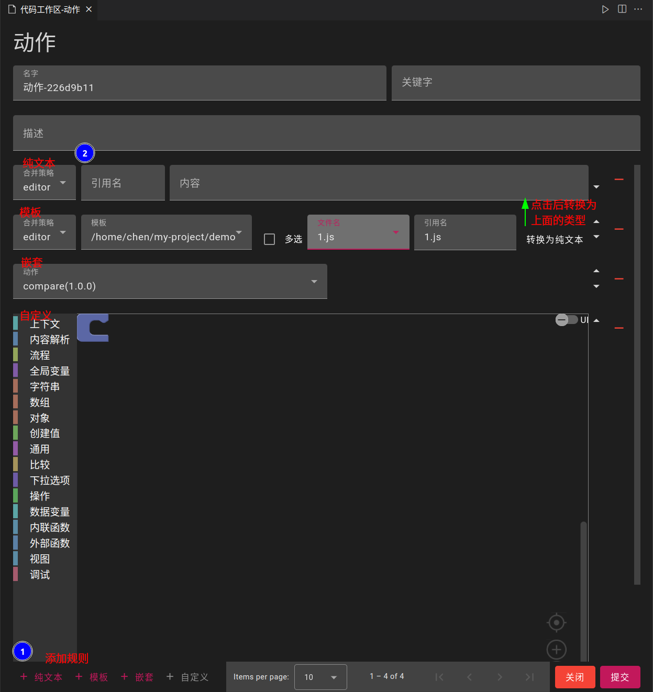

## Creating action
- Open the command panel and enter `code-recycle.create-action` 
> or `code-recycle.code-recycle` in the action configuration to add

## Template rules

- Select the previously processed file and modify the reference name (support variables)

### Merge strategy
- `override`: Overwrite the current file
- `default`: Do not override the current file
- `error`: Throw an exception when a conflict occurs
- `editor`: Handle through the editor

### Multiple selected
- Select multiple files within a template. Select and automatically generate multiple template rules

### Reference names
- Consistent with the previous replacement variable rules

### Convert to plain text
- Convert the modified file content referred to to into a file template
> You can also [automatically convert](../public?id=action-template-conversion-to-text) the text file during publishing

## Pure text rules
- Similar to template rules, allow input content
- No synchronization, but allow custom modification and publishing to the public area

## Nested rules
- Call other actions

## Custom rules
- See [Custom Rules](./custom-rule) page

## Visual action
- See [Visual Actions](./custom-rule?id=visual-action) page