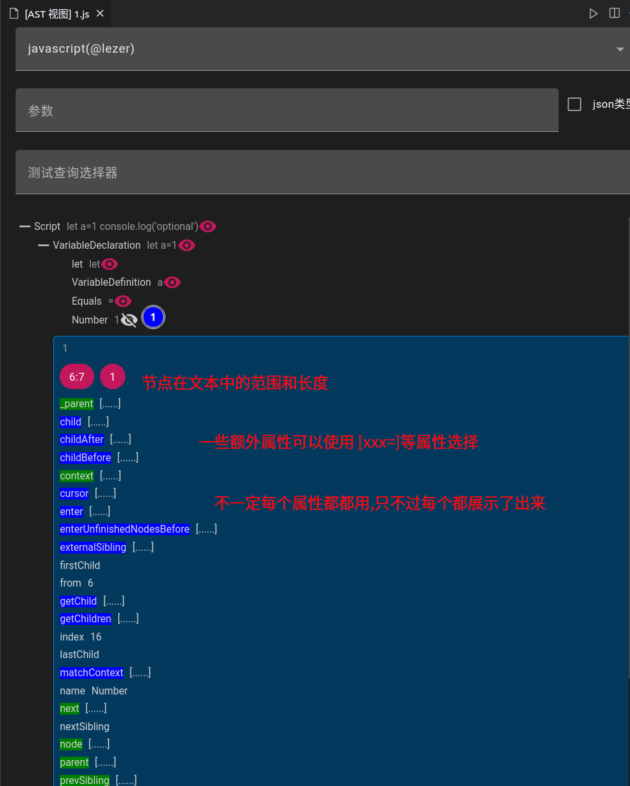

## Syntax Query
- supports 400+ syntax parsers; all can be queried using CSS selector style
- Achieves most of the features of [CSS selectors](https://developer.mozilla.org/en-US/docs/Web/CSS/CSS_selectors)

## CSS Selector Support

| name             | Support                                                                                                                                                                                                  |
| ---------------- | -------------------------------------------------------------------------------------------------------------------------------------------------------------------------------------------------------- |
| `Descendant`     | `*`,` `,`>`,`<`,`+`,`~`,`,`                                                                                                                                                                              |
| `Attribute`      | `[xx]`,`[xx=yy]`,`[xx^=yy]`,`[xx$=yy]`,`[xx*=yy]`,`[xx!=yy]`,`[xx~=yy]` , `[xx\|=yy]`                                                                                                                    |
| `Pseudo`         | `:not`,`:has`,`:is`,`:where`,`:first-child`,`:last-child`,`:only-child`,`:nth-child`,`:nth-last-child`,`:first-of-type`,`:last-of-type`,`:only-of-type`,`:nth-of-type`,`:nth-last-of-type`,**`:raw`**,**`:use`** |
| `Pseudo-element` | `::parent`, `::children(x)` ,`::xx`                                                                                                                                                                      |

### Description

- Implements custom pseudo-class `:raw` to query the `origin` value/tag attributes of the current node

  > xxx:raw([value=yyy]); This selector has a very unusual use case and is only likely to be used in a few situations.
- `::parent` queries the parent element
- `::children(x)` queries the xth child element of the current element
- `::xx` queries a custom sub-element defined in the current language
- The custom pseudo-class `:use` is similar to `:is`, but can query brothers and descendants.

## query general attributes of nodes
- `index` index, representing the position of the current node in its parent
- `tag` tag of the node
- `value` text of the node
- `range` position of the node
- `children` child elements of the node
- `type` type of the node (node/token)
### Examples

The above `AST view` screenshot is used as the reference.

- `VariableDeclaration`=> Query nodes with tag `VariableDeclaration`
- `VariableDeclaration:has(VariableDefinition[value=a])`=> Query the child nodes of `VariableDeclaration` that have `VariableDefinition` tag and its content (value) is `a`
- `VariableDeclaration::children(0)`=> Query the 0th child node of `VariableDeclaration`=> `let`
- `let:use(*,+VariableDefinition)`=> Query the nodes that `let` itself and its sibling nodes are `VariableDefinition`
- `VariableDeclaration[name=VariableDeclaration]`=> Query the nodes in `VariableDeclaration` nodes that have `name` attribute as `VariableDeclaration`

### Supported languages/grammar
- typescript(typescript)
- typescript(javascript)
- typescript(typescriptreact)
- typescript(javascriptreact)
- @angular/compiler(ng-html)
- @angular/compiler(html)
- htmlparser2(html)
- htmlparser2(xml)
- jsonc-parser(json)
- gsql-ast-parser(sql)
- @vue/compiler-dom(vue)

| @lezer     |        |       |          |
| ---------- | ------ | ----- | -------- |
| cpp        | css    | html  | java     |
| javascript | json   | lezer | markdown |
| php        | python | rust  | sass     |
| xml        |        |       |          |

| antl4                        |                             |                       |                             |                             |                             |
| ---------------------------- | --------------------------- | --------------------- | --------------------------- | --------------------------- | --------------------------- |
| abb                          | abnf                        | acme                  | adaparent/ada83             | adaparent/ada95             | adaparent/ada2005           |
| alef                         | algol60                     | alloy                 | alpaca                      | angelscript                 | antlrparent/antlr2          |
| apt                          | arangodb                    | argus                 | arithmetic                  | ASL                         | asmparent/asm6502           |
| asmparent/asm8086            | asmparent/asmMASM           | asmparent/asmZ80      | asmparent/masm              | asmparent/nasm              | asmparent/pdp7              |
| asmparent/ptx-parent/ptx-2.1 | asnparent/asn               | atl                   | b                           | basic                       | bcl                         |
| bibcode                      | Bicep                       | bnf                   | C                           | calculator                  | callable                    |
| caql                         | cayenne                     | clf                   | clojure                     | cmake                       | cobol85                     |
| CPP14                        | cql                         | cql3                  | creole                      | CSS3                        | csv                         |
| cto                          | cypher                      | Dart2                 | datalog                     | dcm                         | dice                        |
| doiurl                       | dot                         | edif300               | edn                         | elixir-parser               | erlang                      |
| esolangparent/brainflack     | esolangparent/cool          | esolangparent/dgol    | esolangparent/lolcode       | esolangparent/loop          | esolangparent/nanofuck      |
| esolangparent/snowball       | esolangparent/wheel         | EVMB                  | fasta                       | fdo91                       | fen                         |
| flowmatic                    | focal                       | fol                   | fortranparent/fortran77     | fortranparent/fortran90     | fusiontables                |
| glsl                         | gml                         | golang                | graphql                     | graphstream-dgs             | gtin                        |
| guitartab                    | html                        | http                  | hypertalk                   | ical                        | icon                        |
| inf                          | informix                    | infosapient           | iri                         | iso8601                     | istc                        |
| jam                          | janus                       | javaparent/java       | javaparent/java8            | javaparent/java20           | jsparent/javascript         |
| jpa                          | json                        | json5                 | karel                       | kirikiri-tjs                | kotlinparent/kotlin         |
| kuka                         | kquery                      | lambda                | lcc                         | less                        | lisa                        |
| lrc                          | ltl                         | Lua                   | Lucene                      | matlab                      | mckeeman-form               |
| memcached                    | metamath                    | metric                | microc                      | modelica                    | modula2                     |
| moo                          | morsecode                   | PowerQuery            | mps                         | muddb                       | mumath                      |
| muparser                     | newick                      | oberon                | oncrpc                      | orwell                      | p                           |
| pascal                       | pbm                         | pcre                  | pddl                        | pdn                         | peoplecode                  |
| pii                          | pl0                         | plucid                | ply                         | PMMN                        | postalcode                  |
| prolog                       | promql                      | propcalc              | properties                  | protobuf2                   | protobuf3                   |
| pythonparent/python3         | qif                         | quakemap              | racket-bsl                  | racket-isl                  | rcs                         |
| refal                        | restructuredtext            | rfc822parent/datetime | rfc822parent/rfc822         | domain                      | filter                      |
| robotwar                     | romannumerals               | ron                   | rpn                         | Corundum                    | rust                        |
| scotty                       | scss                        | semver                | sexpression                 | sgf                         | sharc                       |
| sieve                        | smalltalk                   | smiles                | smtlibv2                    | snobol                      | Solidity                    |
| sqlparent/athena             | sqlparent/derby             | sqlparent/drill       | sqlparent/hiveparent/hivev2 | sqlparent/hiveparent/hivev3 | sqlparent/hiveparent/hivev4 |
| sqlparent/mysql              | sqlparent/plsql             | sqlparent/trino       | sqlparent/tsql              | sqlparent/informix-sql      | stacktrace                  |
| stellaris                    | suokif                      | swift-fin             | szf                         | tcp                         | telephone                   |
| tiny                         | tinybasic                   | tinyc                 | tinymud                     | tl                          | tnt                         |
| trac                         | tsv                         | ttm                   | turing                      | turtle                      | turtle-doc                  |
| unicode/graphemes            | unreal_angelscript          | upnp                  | url                         | useragent                   | vb6                         |
| verilogparent/verilog        | verilogparent/systemverilog | vhdl                  | vmf                         | wavefront                   | webidl                      |
| wkt-crs-v1                   | wln                         | wren                  | xml                         | xpathparent/xpath           | xpathparent/XPath20         |

| tree-sitter       |            |        |                   |                 |               |
| ----------------- | ---------- | ------ | ----------------- | --------------- | ------------- |
| haskell           | javascript | php    | java              | c_sharp         | css           |
| cpp               | python     | c      | ruby              | go              | bash          |
| tsx               | json       | scala  | embedded_template | agda            | jsdoc         |
| tsq               | regex      | ocaml  | ocaml_interface   | dbscheme        | ql            |
| toml              | swift      | ada    | sosl              | soql            | apex          |
| capnp             | clojure    | cmake  | comment           | commonlisp      | cuda          |
| d                 | dockerfile | dot    | elixir            | elm             | elisp         |
| erlang            | fennel     | fish   | formula           | fortran         | gitattributes |
| gleam             | glsl       | gomod  | gowork            | graphql         | hack          |
| jq                | json5      | kotlin | lalrpop           | latex           | lean          |
| tablegen          | lua        | make   | markdown          | markdown_inline | meson         |
| nix               | objc       | org    | pascal            | pgn             | proto         |
| racket            | rasi       | re2c   | rego              | rst             | r             |
| scss              | sexp       | smali  | sourcepawn        | sparql          | sql_bigquery  |
| ssh_client_config | svelte     | thrift | query             | turtle          | twig          |
| vue               | wat        | wast   | wgsl              | yaml            | yang          |

- `tree-sitter` needs to be pulled from the `https://github.com/wszgrcy/tree-sitter-wasm-bundle` repository or customized according to the format. Then, the local path is written into the configuration `code-recycle.parser.tree-sitter.repository`.

?> in CLI set `treeSitterParserDir`