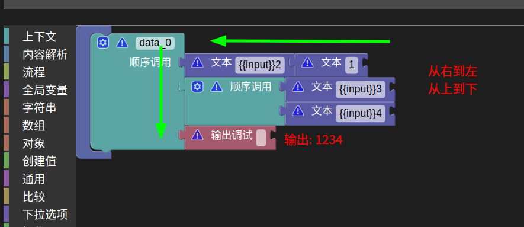
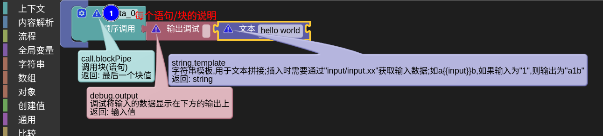
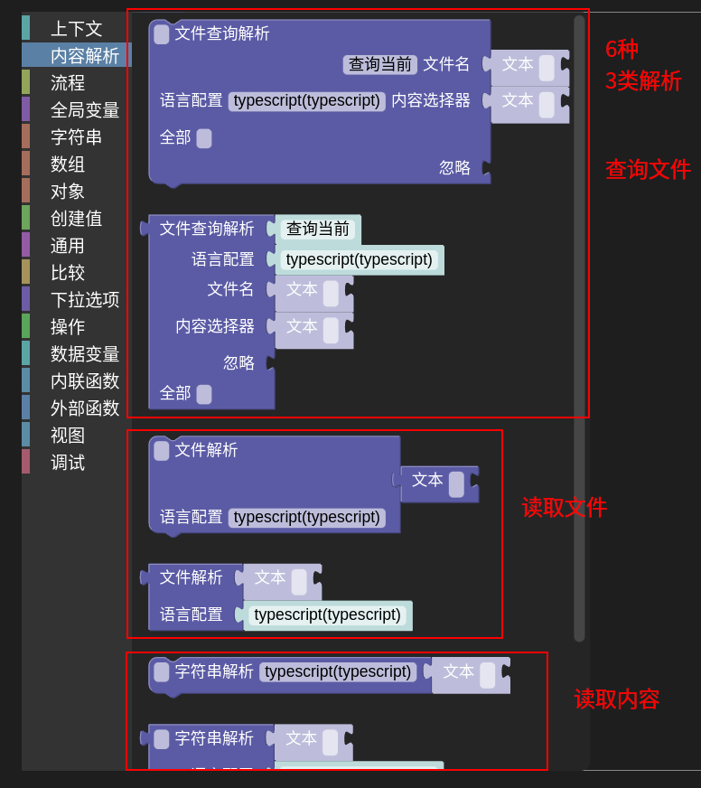
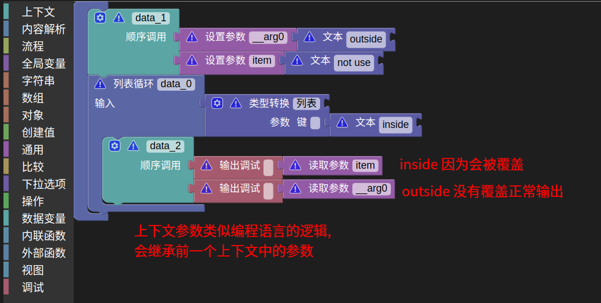
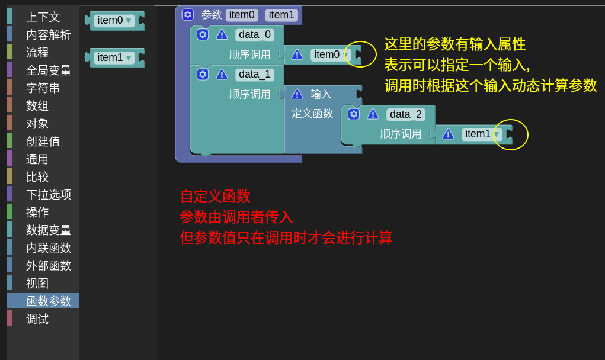
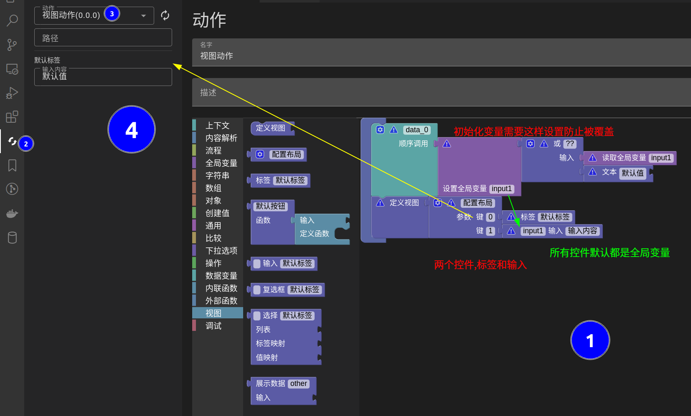

## Custom Rules

- Create custom rules in the action or in the custom functions.
- Custom rules use `blocky` for visual editing
- The input values of statements/blocks are passed in the order of from right to left, from top to bottom.

- The working directory is the folder containing the selected file or the selected folder.

> That is, when using a relative path, it is calculated based on this folder.

## Operation Hints
- Every statement/block has a comment for viewing.

- A sentence with a context can be called a statement; only input/output is called a block.

- After selecting a block, you can copy it using `Ctrl+C` and paste it using `Ctrl+V`.
> Supports cross-action copying.
- Hold down `Alt` to drag and drop a assembled block/statement alone.
- Blocks with a `gears` icon are variable parameters.

## Create content parsing
- Use a specific grammar parser to parse the text, create a content parser
- There are a total of three types of parsing methods: file query parsing, file parsing, and string parsing.

### File Query Parsing
- Use glob and selector to determine the files to parse and create a parser

### File Parsing
- Pass the path or path array to create a parser

### String Parsing
- Create a parser with the string input
> This parser does not have file path

## Node Querying
- Use CSS syntax to query and return matching node results

### Replace Nodes
- By specifying nodes, obtain the range and content,  modify it and transfer `replace node` statement

## Common Blocks
- Every statement/block has a corresponding description
- If there are details that are unclear how to use on some blocks, you can [raise an issue](https://github.com/wszgrcy/code-recycle/issues)

### Read Property
- According to the input path `xx.yy.zz`, read the attributes of the object/list

### Type Conversion
- `object`, `inheritance`: Modify some attributes of an object and return a new object
- `object`, `create`: Create an object
- `list`: Create a list of a fixed length

### Git Template
- Use `git clone` to pull a specific file from a repository

!> Please do not write account passwords in the URL

- Use `git sparse-checkout` to pull, so it only pulls the specific files to be used, and it is faster than normal pulling
- Support binary files and revoke
- Currently, it is only used and undone as an ordinary file.
> Do not support variables written in `{{xx}}` syntax, will be treated as normal files  
> You can modify nodes after selection with a content selector before replacing.

#### Sample resources

- `gitClone`

#### Configurations

- `code-recycle.action.gitClone.tmpDir` sets a temporary folder to save the git content, default is the [operating system temporary folder](https://nodejs.org/dist/latest-v20.x/docs/api/os.html#ostmpdir)

---

## Variables
### Custom Rules-Define Global
- The automatic variable names initialized on each statement correspond to the actual variable names in the `Data Variables` column. This is usually convenient for using these variables in this scope.
- If a function/closure structure is encountered, it is not recommended to use it, as it is equivalent to a global variable in the rule.

### Custom Rules-Context
- Blocks/statements like `if`, `for`, `while`, and `function` generally create a new context scope and pass some built-in parameters such as `item`, `index`, `condition`, and `input`.
- The new context scope inherits from the previous context.
- This scope is closer to the variable effect range in normal code development, but it is difficult to analyze the effect range of context variables, therefore, you can only input variables manually.

### Custom Function-Function Parameters (Custom Function Special)
- Specifies parameters for custom functions
- Function parameters will be executed when the function is called

### Action-Global Variables
- The variable affects the entire action.
- The variable replacement in the template and the optional variable both belong to global variables.
- Action nested and called within other actions also share this variable.

---

## Visual Action
- In an action, only one custom rule can be used and no other rules can be applied
- Similar to standard custom rules, but the last line of code should be `Define View` (`view.view`)

### Initializing Variables
- In a view action, please use `global variables` for assignment
- When initializing assignment, please use `common.or` with `??`
> In the view, each value change will trigger a re-execution of the action, so it is necessary to use `??` to ensure that the data is not re-computed after initialization

## Demonstrative Resources
- Public area `自定义规则输出顺序`,`自定义规则输出2`,`查询替换`,`读取属性`,`上下文参数`,`全局变量`,`视图动作`