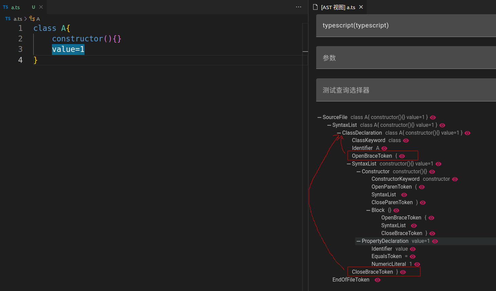

## like mode
- The like mode is a new mode compared to the original `CSS selector` query, mainly aimed at reducing the difficulty for users
- The like mode is not based on text matching, but on ast/cst matching. Although in most cases it can be directly understood, if there is an inability to match, you can use `ast view` to view the nodes of the current file


?> `let a=6` and `let a = 6` represent the same tree in the `typescript` parser, so there is no need to worry about different query results due to different format indentations
### Operations in statements

- `[[$xxx]]` The first time the `xxx` variable is added; Afterwards, we will compare whether the node value is the same as the first one
?> `[[$xxx]]===[[$xxx]]` indicates matching a left and right identical equality check

- `[[$+xxx]]` indicates saving a node to the `xxx` array, and multiple occurrences will append the node to the `xxx` array


- `[[?]]` Match any node (can be empty)
- `[[?:*=a]]`,`[[$xxx:*=a]]` The matching node needs to contain the `a` character
?> `^=a` matches starting with `a` `$=a` matches ending with `a`
- `[[?:/abc/g]]`,`[[$xxx:/abc/g]]` Use regular matching nodes
?> [Regular reference document](https://developer.mozilla.org/en-US/docs/Web/JavaScript/Guide/Regular_expressions)

- Fuzzy matching between `[[{]]` and `[[}]]`


?> When the like pattern matches the first node, it matches the nodes that meet the requirements within the specified node range. This is called fuzzy matching; Use this method to perform fuzzy matching after the previous node

?> for example
```ts
class A{
    constructor(){}
    value=1
}
```



?> Use `class [[?]]{ [[{]] value=1 [[}]] }` to indicate fuzzy matching after `{`, matching to a node list of `value=1`, returning, and then matching `}`; Note that the parent nodes of `{` and `}` need to be the same
### Return
- Use `rule.query.like` or configure `NodeQueryOption` to return a `ComposedNode` type node; This node is a virtual node composed of matched content, and the `children` attribute stores all matched nodes `ComposedNode` can also be used directly in the `selector` mode

- The matched variables (list) will be saved in the `infer` attribute

