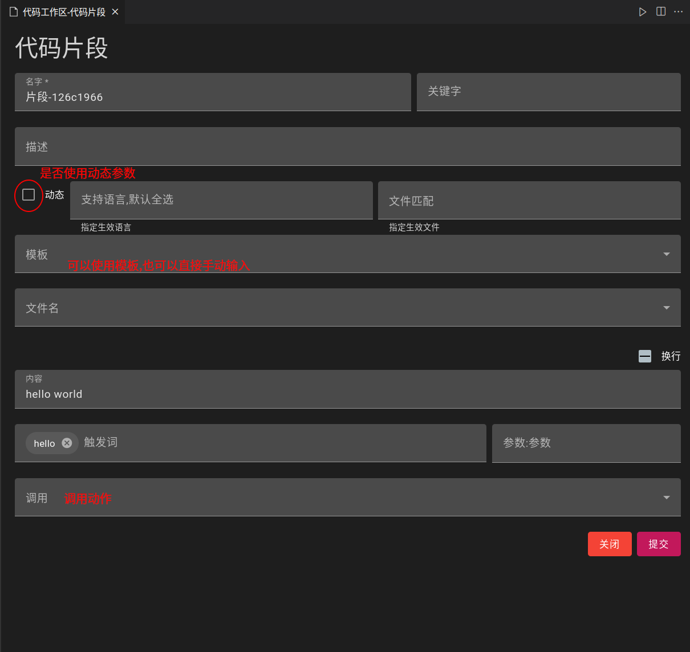
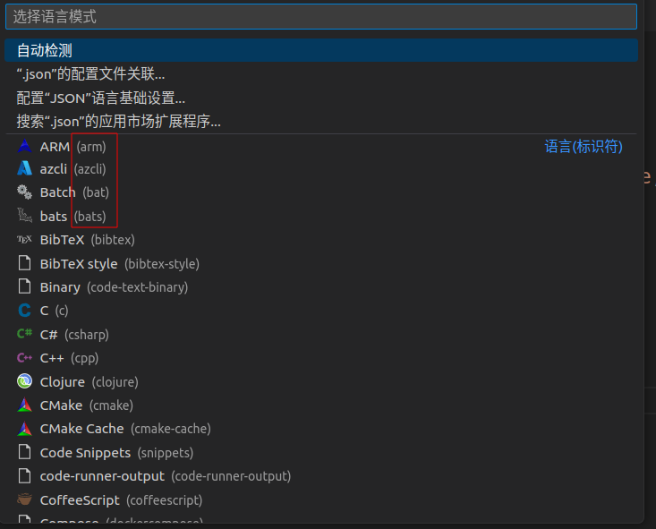

## Create Snippet

- Open the command panel and input `code-recycle.create-snippet` 
> Alternatively, you can input `code-recycle.code-recycle` and then add it to the code snippet configuration.

### Static Code Snippet

- Currently consistent with the functionality in `VSCode`, but with an additional page configuration.

### Dynamic Code Snippet

- Triggers as prefix words require the prefix part or complete match.
- Regular expression matching parameters
> Default `([\p{L}\p{N}]+)` means matching parameters made up of characters and numbers
- When using the syntax of the snippet itself `${1:}` and `{{1}}` for replacement in snippet syntax, write like `${1:{{1~}}}`
> A current design issue will be modified in the future.

### Template Injection

- Select a previously processed file, which automatically converts the `replacement variable` to optional values in the snippet.

## Effective Language

- Specify which languages are available

## Effective Files

- Specify which files are available
> [Effective Files](https://code.visualstudio.com/docs/editor/glob-patterns)  
> `Effective Language` and `Effective Files` can be set together

## Call

- Both static and dynamic code snippets can call the `action`; that is, after completing the snippet completion, it will execute the selected `action`, which will then handle the next steps.

## Default Parameters

- Accept a JSON object, used to input to the snippet
> If multiple code snippets call the same action, but need to be distinguished, it can be used
- This parameter will be covered by the regular expression [capturing group](https://developer.mozilla.org/en-US/docs/Web/JavaScript/Guide/Regular_expressions/Groups_and_backreferences) in the dynamic code snippet .
> `(?<Name>x)`/`(xxx)`
