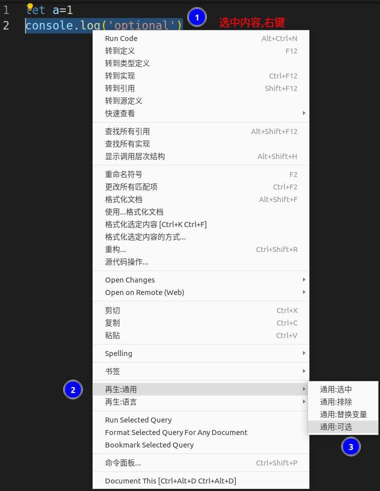
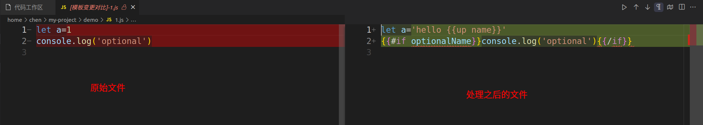
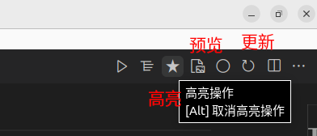
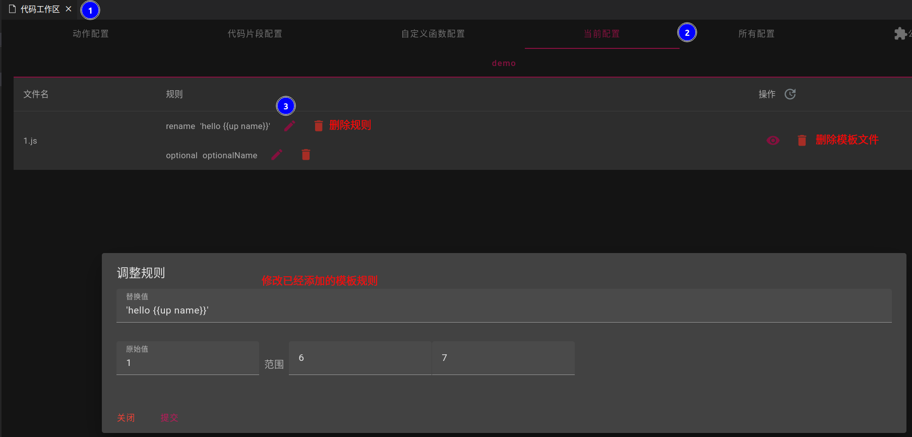

## Direct Add

- Click the right-click button on the file or folder to select `addToTemplate`

- The template currently only supports text files, and adding binary files will result in an exception
- When adding files to the template by selecting `File`, the filter will not be applied

### Filter files in the "Folder" view.
- Expand the current setup to automatically filter binary files using `file-type`.
> By setting `code-recycle.template.autoFilterBinary` close the automatic filter
> If there are error checks, you can raise an [Issue](https://github.com/wszgrcy/code-recycle/issues)
- By setting `code-recycle.templateIgnore` execute ignore file
> Default `**/.gitignore`,`**/.codeignore`

### Template Trimming
- When trimming the template, if the file is not added to the template, it will be `addToTemplate`
- Template trimming can only be done in files that are not in edit mode

### Select content replacement
- Select the content, right-click and select `recycle:common` => `select replace`
- Content replacement can be done directly for plain text, or can add variables `{{xxx}}`, variables will be popped up for interaction when executed
- Variables can be formatted; currently support `'upcase','downcase','capitalize''camelcase','pascalcase','kebabcase'`, such as input `{{upcase xxx}}` will convert the input content to uppercase
> You can also only input the first few characters, such as `upcase`=>`u`, `capitalize`=>`cap`

### Select content optional
- Select the content, right-click and select `recycle:common` => `general:optional`
- Specify a variable name, and a dialog box will be popped up for confirmation when executing

## Template selection
- Select the content, right-click and select `recycle:common` => `general:select` / `general:unSelect`
- Determine which ranges of content in the file will be used as template output

## Template preview
- Click the editor operation (top right corner) `star` icon, highlight the template processing ranges in the editor
> Hold `Alt` operation to cancel highlighting
- Click the editor operation (top right corner) `file-media` icon, the content on the right is the template content

## Template update
- After the file content is modified, synchronize the template trimming operation range
- Click the editor operation (top right corner) `refresh` icon, synchronize the operation
> After making changes, a preview of the modified content should be checked to ensure it meets the requirements. If there are anomalies, the template operation needs to be modified/deleted in the configuration.

## Template operation modification
- Open the configuration, then modify the relevant parameters of `replace variable` or `optional` in the `current template`.

## Git template
- See[Custom rule](./custom-rule?id=git-template)