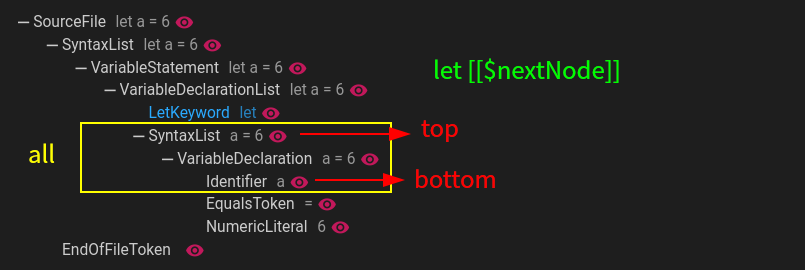

## like mode
- This pattern compares the input string with the node structure in the AST/CST and matches the appropriate node.

> In `TypeScript`,` let a=6` and `let a = 6` represent the same tree, so their query results are also the same. You don't have to worry about the query results being different due to indentation.  
> If there is no match, you can use `ast view` (in VSCode) to view the current file's nodes; it might be using an AST and ignoring some unimportant nodes.
### The operation in the statement.

- `[[$xxx]]` The first time `xxx` is saved to a variable; later, it will be compared with the value of the first node.

> `[[$xxx]]===[[$xxx]]`It represents a match for a left-equal-to-right check.
- `[[$+xxx]]` It represents saving the node to the `xxx` array, and the node will be appended to the `xxx` array multiple times.
- `[[?]]` Match any node (can be empty)
- `[[?:*=a]]`,`[[$xxx:*=a]]` The matched node needs to contain the character `a`.

> `^=a` Match starts with`a` `$=a` Match ends with`a` 

- `[[?:/abc/g]]`,`[[$xxx:/abc/g]]` Use regular expression to match nodes.

> [Regular expression reference document](https://developer.mozilla.org/en-US/docs/Web/JavaScript/Guide/Regular_expressions)

- `[[...]]` Fuzzy match

> Skip any number of characters.

- `[[{]]`and`[[}]]` Fuzzy matching within a region.

> Fuzzy search within two identical nodes.

?> For example
```ts
class A{
    constructor(){}
    value=1
}
```


?> Using `class [[?]]{ [[{]] value=1 [[}]] }` indicates a fuzzy match after the `{`, and returns when the `value=1` node list is matched. Then, it continues to match the `}`. Please note that the parent node of `{` and `}` must be the same.

### Return content.
- Use `rule.query.like` or configure `NodeQueryOption` to return a `ComposedNode` type node; This node is a virtual node composed of matched content, and the `children` attribute stores all matched nodes `ComposedNode` can also be used directly in the `selector` mode

- The matched variables (list) will be saved in the `infer` attribute

### MatchLevel
- [document](api-docs/interfaces/NodeQueryOption.html#modeOptions ':ignore')
- Using methods such as `[[$xxx]]`, `[[?]]`, etc. will retrieve the next node, but there may be multiple nodes next to the current node (due to child nodes), so it is necessary to specify the matching level
- `all` Match all possible results
- `top` Match Top Level
- `bottom` Match the lowest level (leaf node)



?> When using `top`/`bottom` for matching hierarchy, it only tries to match nodes as much as possible. If it cannot be matched, it will retreat to nodes closer to the `top`/`bottom` for attempting
