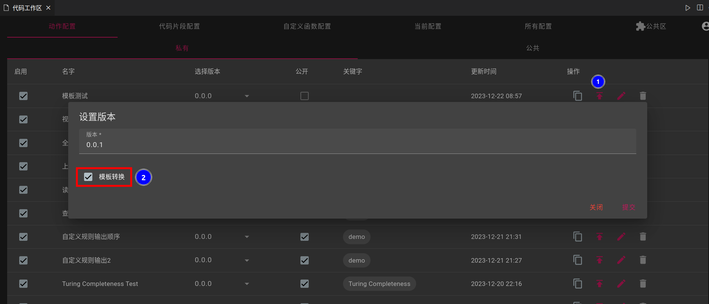
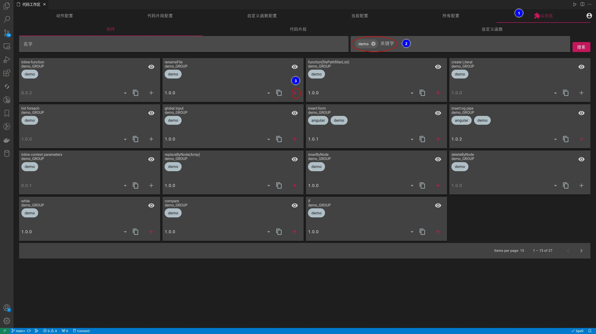
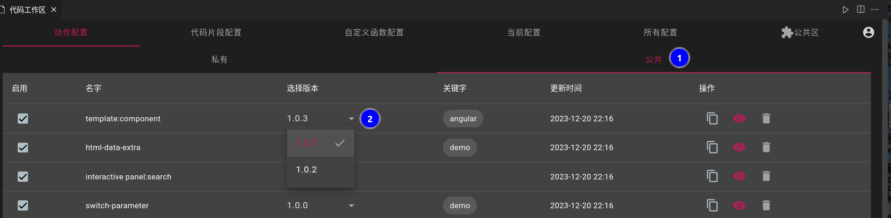

## Public
- If you want to make your designed resources available to others, you need to make them public
- The public methods for `action`, `code snippet`, and `custom function` are the same
- In the command panel, enter `code-recycle.code-recycle`.

- Any resource needs to be specified with a version before being made public; after specifying the version, the version cannot be edited and can only be deleted
- The `0.0.0` version is a private version for itself and will not be called by others; each release of a version is a copy of the current version as a new version

### (Action) Template Conversion to Text
- When the action is released, the template rules will be converted to pure text rules
> Because template rules cannot be made public; if you do not need to make this action public, then there is no need to check this box

## Add Public Resources
- In the command panel, enter `code-recycle.code-recycle` to find the public area
- In the public area, select the desired resources and click `+` to add

## Modify Usage Version
- The private and public resources have the same method to modify the usage version

## Cancel Public
- Uncheck the box to cancel

!> Canceled, other users who use this resource will not be able to use it; but if a new resource is created by copying this resource, this restriction does not apply