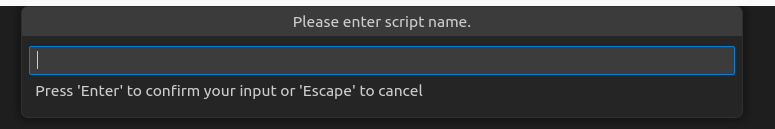
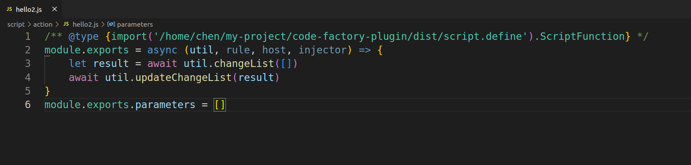
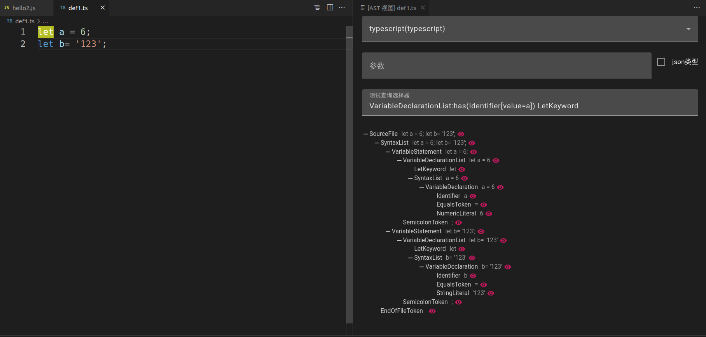
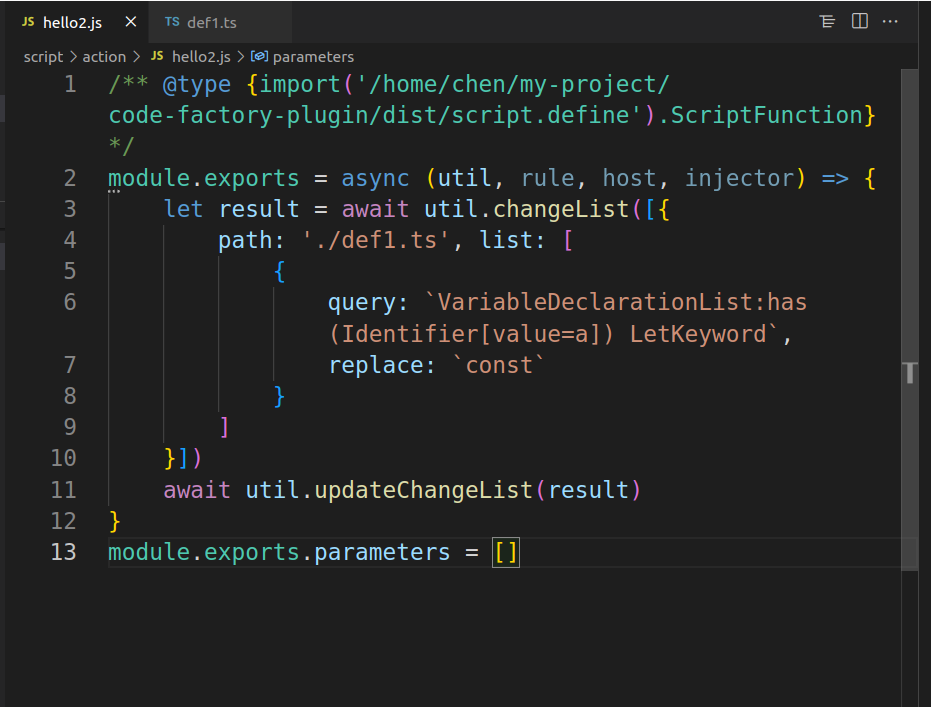

## Installation

- [Plugin Marketplace](https://marketplace.visualstudio.com/items?itemName=LDXCODE.code-recycle)
- Visual Studio Code marketplace


## Create a new script folder
- Choose a location to create a folder and create it in the following hierarchy


?> You can refer to the [Demo Repo](https://github.com/wszgrcy/code-recycle-plugin-script)


```tree
.
├── action 
│   ├── hello2.js
│   └── hello.js
├── snippet 
│   ├── hello2.js
│   └── manifest.json
└── view 
    ├── hello2.js
    └── hello.js
```

## Create Script
- Use the `editor` to open the created folder, then right-click to quickly create a script




## Editor Script



- Here we demonstrate how to change the `a` declaration in a file from `let` to `const`


### Test Selector
- Click on the corresponding node to automatically copy the relevant labels



### Implementation


## More?

- [Script Util](./script-util.md) Introduce