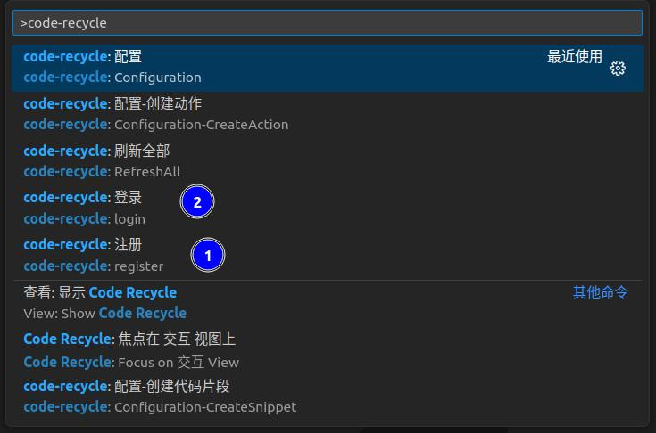

## Installation

- [Plugin Marketplace](https://marketplace.visualstudio.com/items?itemName=LDXCODE.code-recycle)
- Visual Studio Code marketplace

## Login
Need to log in first to use all the features of this extension
> Open the command palette (right-click)  
> Register Command `code-recycle:register`  
> Login Command `code-recycle:login`

?> Because some of the extension's features are quite complex, you may need other resources designed by others during use. Therefore, you need to log in.

?> The extension's `Abstract Syntax Tree Debugging` does not require login.

## Design

- [Template](./design/template), [Snippet](./design/snippet), [Custom Rule](./design/custom-rule) implementation all belong to the design part
- If you use other users' public resources, you can skip this step

## Call
Through the following ways:
- [Snippet](./call-snippet) directly use
> Static Code Snippets: exactly the same as VSCode  
> Dynamic Code Snippets: need to input different parameters according to the defined snippets for execution
- [Select a file or folder and right-click to execute.](./call-action?id=call-in-filedirectory)
> The specific position depends on the executed `action`
- [VisualAction](./call-action?id=visual-action)