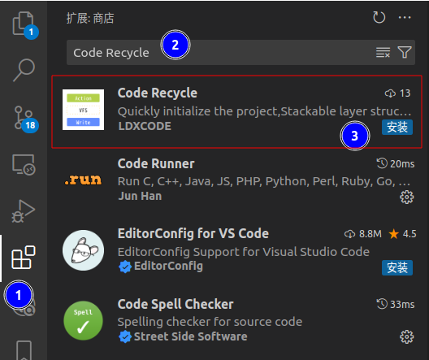
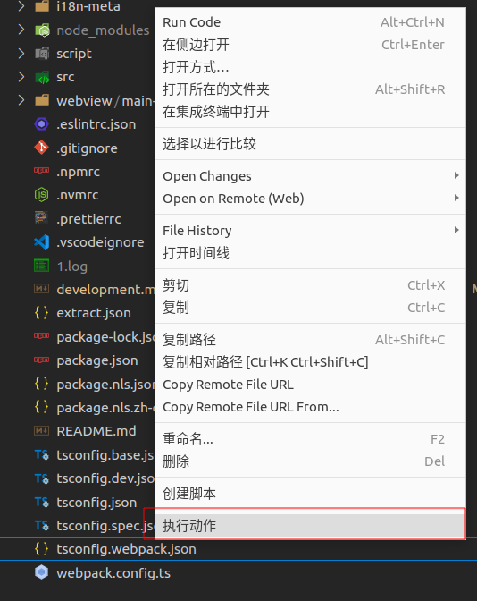
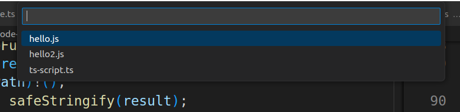

# Quick Start

## CLI
- Need to install the [node environment](https://nodejs.org/en/download)


#### Install
- Global `npm i @code-recycle/cli -g`
- Within the project`npm i @code-recycle/cli -D`

#### Call
- `code-recycle ./hello.js`
- `code-recycle ./hello.ts`
- `code-recycle ./hello.yaml`

> Need to add `npx` or define in the `script` section of the `package.json` file in the project.


---

## VSCode Extension
- [Plugin marketplace website](https://marketplace.visualstudio.com/items?itemName=LDXCODE.code-recycle)
- VS Code Marketplace




### Create a new script folder
- Select a location to create the folder

> or `git clone https://github.com/wszgrcy/code-recycle-plugin-script.git`


- Modify editor settings`settings.json`

```json
"code-recycle.script": {
    "dir": "/path/to/code-recycle-plugin-script"
}
```


?> Can refer to the [demo repository](https://github.com/wszgrcy/code-recycle-plugin-script)

- Create the folder hierarchy as follows:

```tree
.
├── action
│   ├── hello2.js
│   └── hello.js
├── snippet
│   ├── hello2.js
│   └── manifest.json
└── view
    ├── hello2.js
    └── hello.js
```

### Call 
- Right-click on a file



- Select the script to run
?> The relative path in the script should be based on the folder or the file folder of the file.



---


## Script implementation
### typescript

```ts
// cli中使用
import type { ScriptFunction } from '@code-recycle/cli';
// vscode中使用
// import type { ScriptFunction } from '../script.define';
let fn: ScriptFunction = async (util, rule, host, injector) => {
  let list = await util.changeList([
    {
      path: './test/test.ts',
      list: [{ query: 'let a=[[$var]]', mode: 'like', replace: { var: '7' } }],
    },
  ]);
  await util.updateChangeList(list);
};
export default fn;

```

### js

```js
// cli中使用
/** @type {import('@code-recycle/cli').ScriptFunction} */

// vscode中使用
/** @type {import('../script.define').ScriptFunction} */
module.exports = async (util, rule, host, injector) => {
  let list = await util.changeList([
    {
      path: './test/test.ts',
      list: [{ query: 'let a=[[$var]]', mode: 'like', replace: { var: '7' } }],
    },
  ]);
  await util.updateChangeList(list);
}
```

### yaml
- The YAML configuration is exactly the same as the js/ts, but some APIs cannot be used, limiting the freedom.

```yaml
changeList:
- path: ./test/test.ts
  list:
    - query: let a=[[$var]]
      mode: like
      replace: 
        var: '7'
```

## More
- [Config](./config.md)
- [Script Development](./script-development.md)
