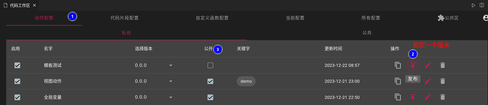
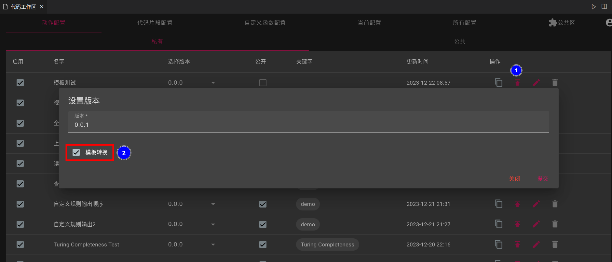
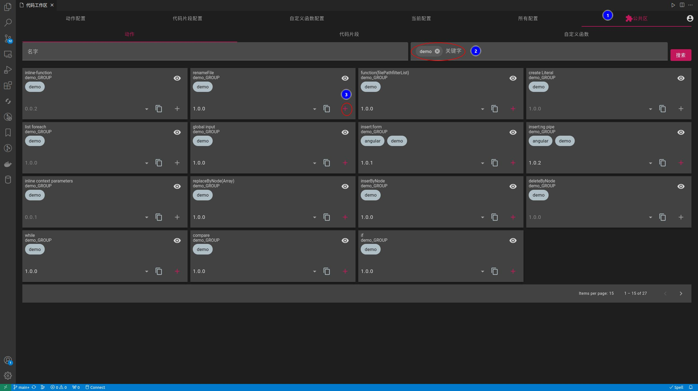
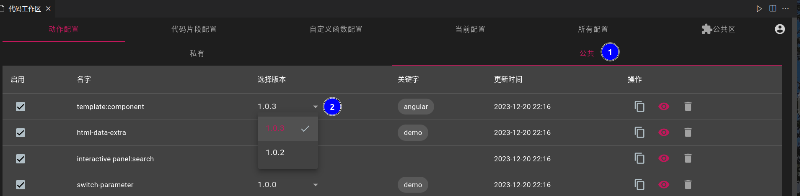

## 公开
- 如果想把自己设计的资源给其他人使用,需要公开
- `动作`,`代码片段`,`自定义函数`的公开方法都一样
- 命令面板,输入`code-recycle.code-recycle`

- 任何资源都需要先指定版本后,再进行公开;指定版本后,该版本不可编辑,只能删除
- `0.0.0`版本为自身私有版本,不会被其他人调用;每次发布版本都是在这个版本上复制一份作为新版本

### (动作)模板转换为文本
- 动作发布时,会将模板规则转换为纯文本规则
> 因为模板规则无法公开;如果您不需要公开此动作则不需要勾选

## 添加公共资源使用
- 命令面板,输入`code-recycle.code-recycle`,找到公共区
- 在公共区选择需要的资源点击`+`添加

## 修改使用版本
- 私有和公共资源修改使用版本的方法相同 

## 取消公开
- 取消勾选即可

!> 取消后,其他使用此资源的用户将无法使用;但如果使用复制操作产生新的资源不在此限制

