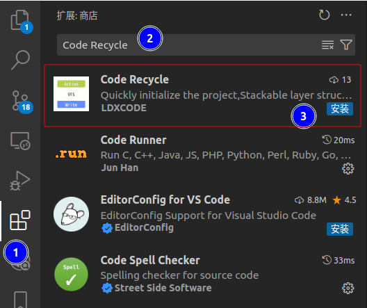
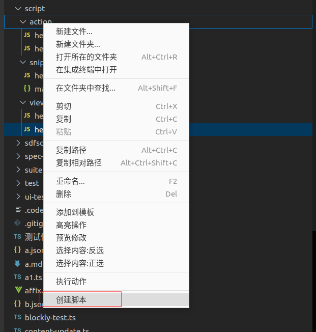
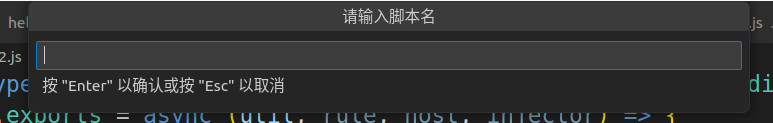
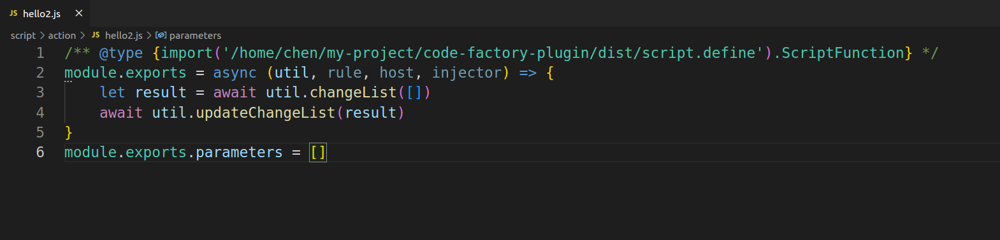
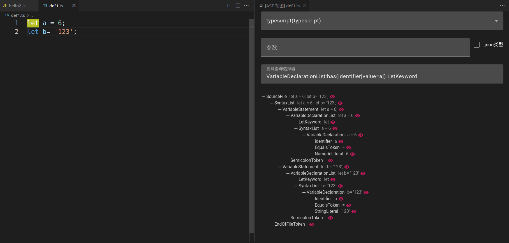
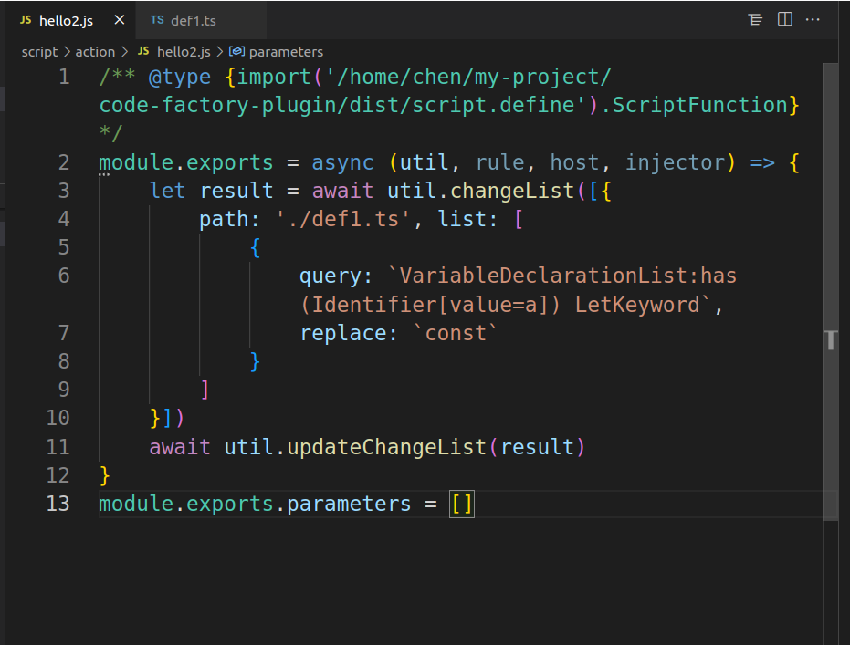

## 安装
- [插件市场网页](https://marketplace.visualstudio.com/items?itemName=LDXCODE.code-recycle)
- VSCode 商店 



## 新建脚本文件夹
- 选择一个位置创建文件夹

- 修改编辑器设置`settings.json`

```json
"code-recycle.script": {
    "dir": "/path/to/code-recycle-plugin-script"
}
```


?> 可以参考[演示仓库](https://github.com/wszgrcy/code-recycle-plugin-script)

- 按照以下层级创建

```tree
.
├── action // 执行动作
│   ├── hello2.js
│   └── hello.js
├── snippet // 代码片段
│   ├── hello2.js
│   └── manifest.json
└── view //视图
    ├── hello2.js
    └── hello.js
```

## 创建脚本
- 使用`编辑器`打开创建的文件夹,然后右键快速创建脚本





## 编辑脚本



- 这里我们演示一个,将文件中`a`声明,由`let`改为`const`

### 测试选择器
- 点击对应节点,自动复制相关标签



### 实现


## 更多?

- [脚本工具](./脚本工具.md)介绍