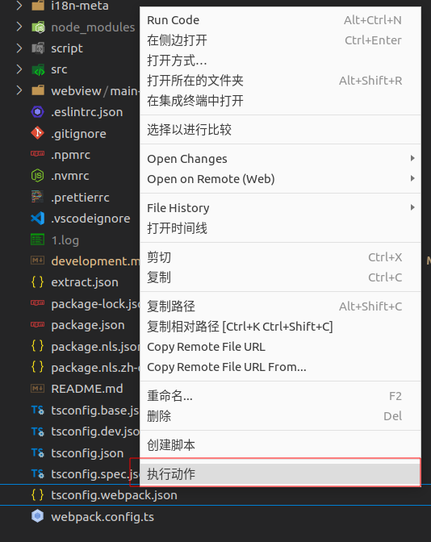
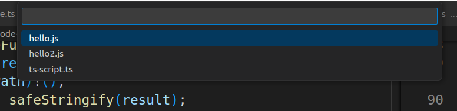

# 快速开始

## CLI
- 需要[安装node环境](https://nodejs.org/en/download)


#### 安装
- 全局 `npm i @code-recycle/cli -g`
- 项目内`npm i @code-recycle/cli -D`

#### 调用
- `code-recycle ./hello.js`
- `code-recycle ./hello.ts`
- `code-recycle ./hello.yaml`

> 项目内需要加上`npx`或在`package.json`的`script`中定义


---

## VSCode Extension
- [插件市场网页](https://marketplace.visualstudio.com/items?itemName=LDXCODE.code-recycle)
- VSCode 商店 


### 新建脚本文件夹
- 选择一个位置创建文件夹

> 或者`git clone https://github.com/wszgrcy/code-recycle-plugin-script.git`


- 修改编辑器设置`settings.json`

```json
"code-recycle.script": {
    "dir": "/path/to/code-recycle-plugin-script"
}
```


?> 可以参考[演示仓库](https://github.com/wszgrcy/code-recycle-plugin-script)

- 按照以下层级创建

```tree
.
├── action // 执行动作
│   ├── hello2.js
│   └── hello.js
├── snippet // 代码片段
│   ├── hello2.js
│   └── manifest.json
└── view //视图
    ├── hello2.js
    └── hello.js
```

### 调用 
- 右键点击在某一文件上



- 选择运行的脚本
?> 脚本中的相对路径以该文件夹或该文件所在文件夹为准



---


## 脚本实现
### typescript

```ts
// cli中使用
import type { ScriptFunction } from '@code-recycle/cli';
// vscode中使用
// import type { ScriptFunction } from '../script.define';
let fn: ScriptFunction = async (util, rule, host, injector) => {
  let list = await util.changeList([
    {
      path: './test/test.ts',
      list: [{ query: 'let a=[[$var]]', mode: 'like', replace: { var: '7' } }],
    },
  ]);
  await util.updateChangeList(list);
};
export default fn;

```

### js

```js
// cli中使用
/** @type {import('@code-recycle/cli').ScriptFunction} */

// vscode中使用
/** @type {import('../script.define').ScriptFunction} */
module.exports = async (util, rule, host, injector) => {
  let list = await util.changeList([
    {
      path: './test/test.ts',
      list: [{ query: 'let a=[[$var]]', mode: 'like', replace: { var: '7' } }],
    },
  ]);
  await util.updateChangeList(list);
}
```

### yaml
- yaml 配置与js/ts完全一样,只是无法使用部分api,自由度受限

```yaml
changeList:
- path: ./test/test.ts
  list:
    - query: let a=[[$var]]
      mode: like
      replace: 
        var: '7'
```

## 更多
- [配置](./配置.md)
- [脚本开发](./脚本开发.md)
