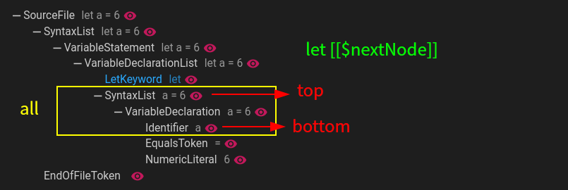

## like模式
- 该模式将输入字符串与AST/CST中的节点结构进行比较,并匹配出合适的节点

> `let a=6`与`let a = 6`在`typescript`解析器中代表同一种树,所以其查询结果也是一样.不用担心缩进导致的查询结果不同  
> 如果遇到无法匹配的情况下可以使用`ast view`(VSCode中)查看当前文件的节点;可能是使用的AST,忽略了一些不重要的节点
### 语句中的操作

- `[[$xxx]]` 第一次将`xxx`保存到变量中;之后会比较是否与第一次的节点值相同

> `[[$xxx]]===[[$xxx]]`表示匹配一个左右相同的等于判断
- `[[$+xxx]]` 表示将节点保存到`xxx`数组中,多次出现会将节点追加到`xxx`数组中
- `[[?]]` 匹配任意节点(可以为空)
- `[[?:*=a]]`,`[[$xxx:*=a]]` 匹配的节点需要包含`a`字符

> `^=a` 匹配起始为`a` `$=a` 匹配结尾为`a` 

- `[[?:/abc/g]]`,`[[$xxx:/abc/g]]` 使用正则匹配节点

> [正则参考文档](https://developer.mozilla.org/en-US/docs/Web/JavaScript/Guide/Regular_expressions)

- `[[...]]` 模糊匹配

> 跳过任意多的字符

- `[[{]]`与`[[}]]` 区域模糊匹配

> 在两个同级节点内进行模糊搜索

?> 比如
```ts
class A{
    constructor(){}
    value=1
}
```


?> 使用`class [[?]]{ [[{]] value=1 [[}]] }` 表示在`{`之后进行模糊匹配,匹配到`value=1`节点列表后返回,再匹配 `}`;注意`{`与`}`的父节点需要相同

### 返回内容
- 使用`rule.query.like`或配置`NodeQueryOption`返回`ComposedNode`类型节点;该节点为匹配到的内容组合成的虚拟节点,`children`属性内保存所有匹配到的节点;`ComposedNode`也可以在`selector`模式中直接使用
- 匹配到的变量(列表)会保存到`infer`属性中

### 匹配层级
- [文档](api-docs/interfaces/NodeQueryOption.html#modeOptions ':ignore')
- 使用`[[$xxx]]`,`[[?]]`等方法会获取下一个节点,但是存在当前节点的下一个节点可能有多个(因为子节点的原因),所以需要指定匹配层级
- `all` 匹配所有可能结果
- `top` 匹配最上级
- `bottom` 匹配最下级(叶子节点)



?> 匹配层级使用`top`/`bottom`时只是尽可能匹配节点,如果无法匹配到会会退到更接近`top`/`bottom`的节点进行尝试
