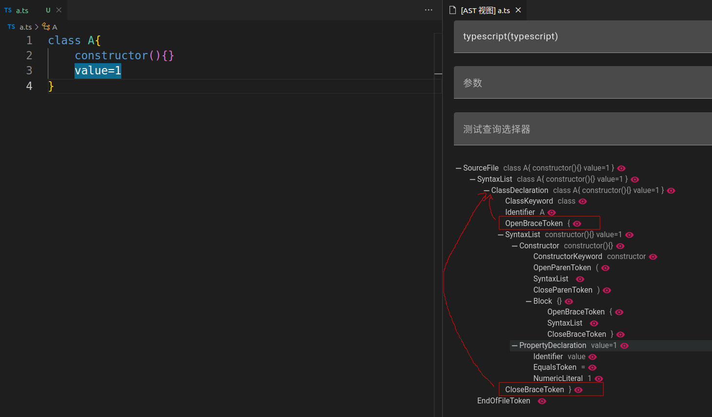

## like模式
- like模式是相对于原`css selector`查询的新模式,主要为降低使用者的难度
- like模式并不是基于文本匹配,而是基于ast/cst匹配,虽然大部分情况下可以直接理解,如果遇到无法匹配的情况下可以使用`ast view`查看当前文件的节点

?> `let a=6`与`let a = 6`在`typescript`解析器中代表同一种树,不用担心因为格式缩进不同导致查询不同结果
### 语句中的操作

- `[[$xxx]]` 第一次将`xxx`变量中;之后会比较是否与第一次的节点值相同

?> `[[$xxx]]===[[$xxx]]`表示匹配一个左右相同的等于判断
- `[[$+xxx]]` 表示将节点保存到`xxx`数组中,多次出现会将节点追加到`xxx`数组中
- `[[?]]` 匹配任意节点(可以为空)
- `[[?:*=a]]`,`[[$xxx:*=a]]` 匹配的节点需要包含`a`字符

?> `^=a` 匹配起始为`a` `$=a` 匹配结尾为`a` 

- `[[?:/abc/g]]`,`[[$xxx:/abc/g]]` 使用正则匹配节点

?> [正则参考文档](https://developer.mozilla.org/en-US/docs/Web/JavaScript/Guide/Regular_expressions)

- `[[{]]`与`[[}]]` 模糊匹配

?> like模式匹配第一个节点时会从指定节点范围内匹配符合要求的节点.称为模糊匹配;使用该方法在前一个节点后进行模糊匹配

?> 比如
```ts
class A{
    constructor(){}
    value=1
}
```


?> 使用`class [[?]]{ [[{]] value=1 [[}]] }` 表示在`{`之后进行模糊匹配,匹配到`value=1`节点列表后返回,再匹配 `}`;注意`{`与`}`的父节点需要相同

### 返回内容
- 使用`rule.query.like`或配置`NodeQueryOption`返回`ComposedNode`类型节点;该节点为匹配到的内容组合成的虚拟节点,`children`属性内保存所有匹配到的节点;`ComposedNode`也可以在`selector`模式中直接使用
- 匹配到的变量(列表)会保存到`infer`属性中