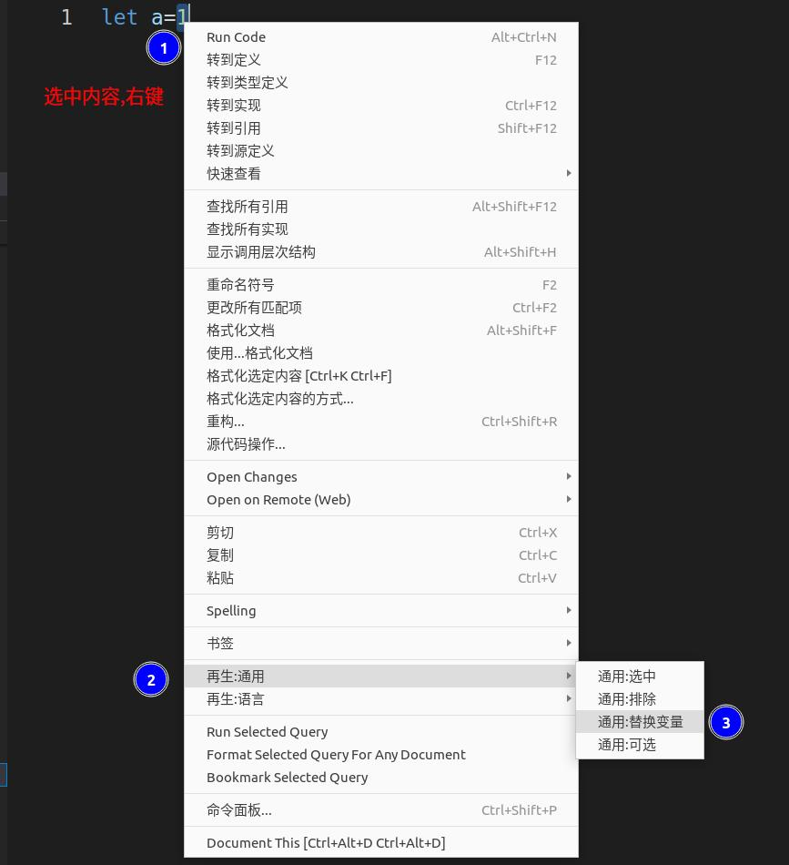
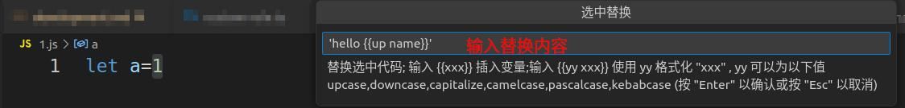
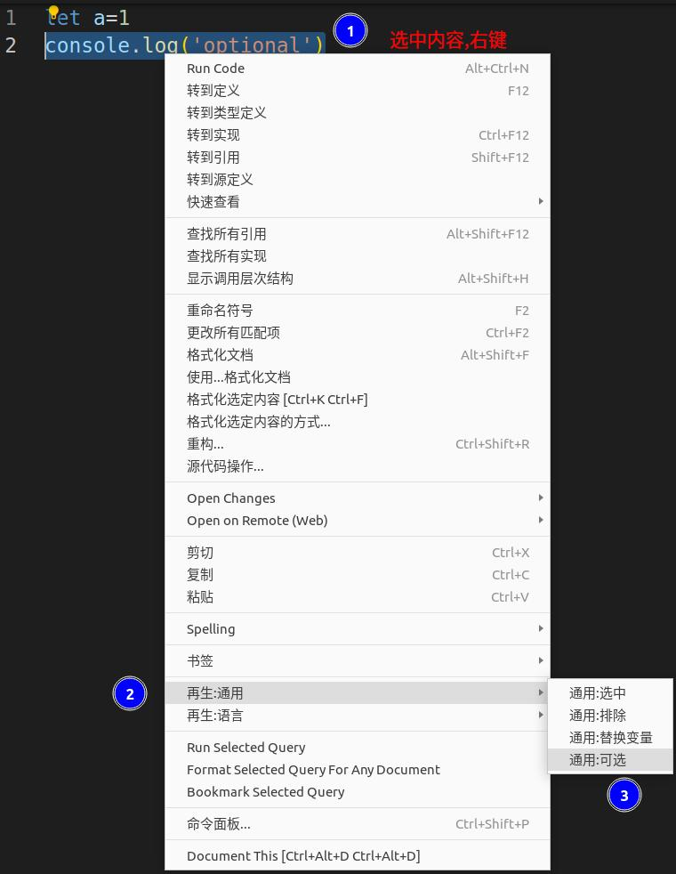
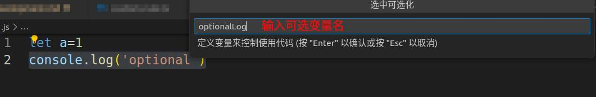
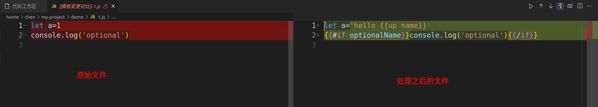
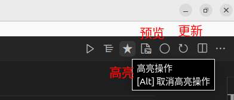
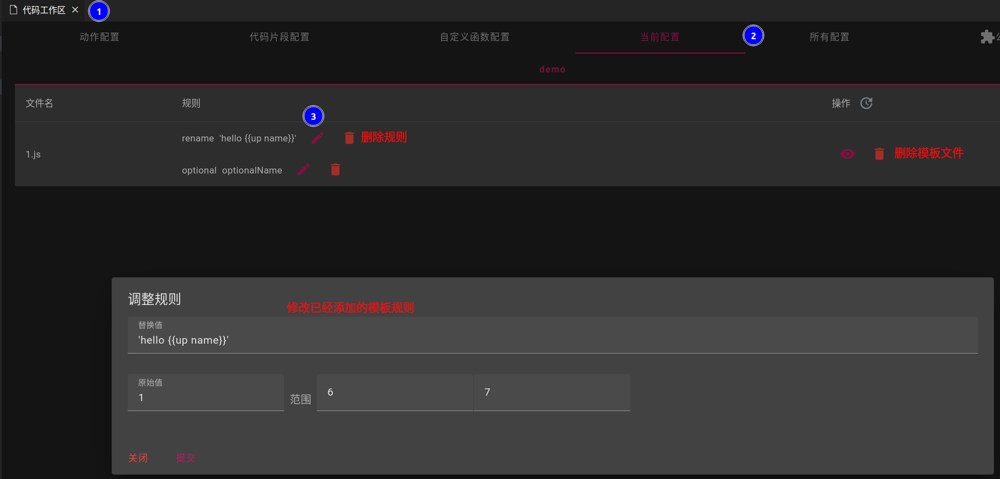

## 直接添加
- 在文件或文件夹上点击右键选择`添加到模板`

- 模板目前只支持文本文件,二进制文件添加将会出现异常
- 选择`文件`添加到模板中时,过滤将不会生效

### `文件夹`中过滤文件
- 拓展目前通过`file-type`自动过滤二进制文件
> 通过设置`code-recycle.template.autoFilterBinary`关闭自动过滤
> 如果存在错误判断可以提[Issue](https://github.com/wszgrcy/code-recycle/issues)
- 通过设置`code-recycle.templateIgnore`执行忽略文件
> 默认 `**/.gitignore`,`**/.codeignore`
  

## 模板裁剪
- 进行模板裁剪时,如果该文件未添加到模板中,将会`添加到模板`
- 模板裁剪仅可在未处于编辑状态中的文件中进行

### 选中内容替换
- 选中内容后,右键`再生:通用`=>`通用:替换变量`
- 内容替换可以直接为纯文本,也可以增加变量`{{xxx}}`,变量将在执行时弹出交互窗口
- 变量可以被格式化;目前支持`'upcase','downcase','capitalize''camelcase','pascalcase','kebabcase'`,如输入`{{upcase xxx}}`则将输入的内容大写化
> 您也可以只输入前面几个字符,如`upcase`=>`u`,`capitalize`=>`cap`

### 选中内容可选
- 选中内容后,右键`再生:通用`=>`通用:可选`
- 指定一个变量名,执行时会弹出选项确认是否需要显示选中的内容

## 模板选中
- 选中内容后,右键`再生:通用`=>`通用:选中`/`通用:排除`
- 确定文件中哪些范围内的内容将会作为模板输出

## 模板预览
- 点击编辑器操作(右上角)中的`star`图标,高亮显示模板中的哪些范围做了处理
> 按住`Alt`操作取消高亮
- 点击编辑器操作(右上角)中的`file-media`图标,出现diff编辑器,右侧内容为模板内容

## 模板更新
- 当文件内容被修改后,需要同步修改模板裁剪操作范围
- 点击编辑器操作(右上角)中的`refresh`图标,同步修改操作
> 修改后需要预览一下修改内容是否符合要求,否则需要到配置中修改/删除模板操作

## 模板操作修改
- 打开配置,然后在`当前模板`中修改`替换变量`或`可选`的相关参数

## Git模板
- 见[自定义规则](./自定义规则?id=git模板)