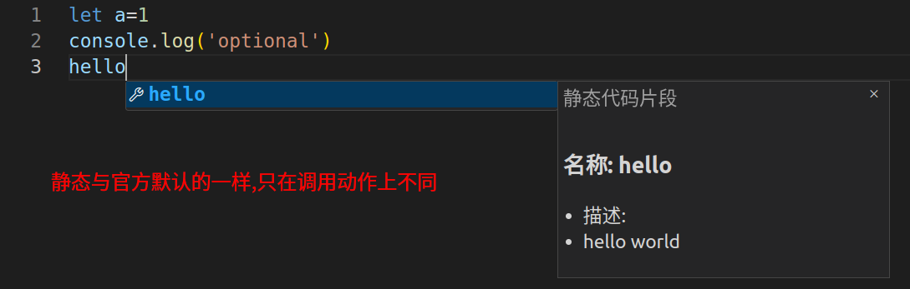
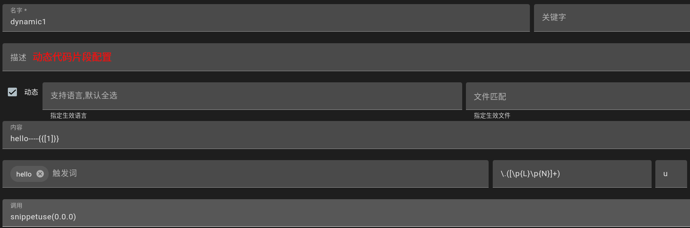
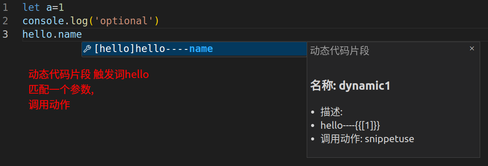
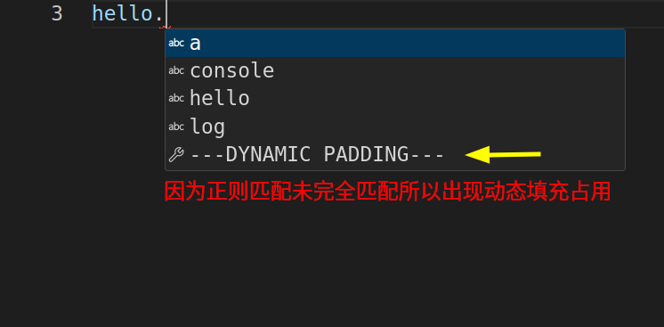

## 调用代码片段
- 代码片段添加后自动生效

## 动态占位符
- 当使用动态代码片段时,由于正则匹配无法预测,所以当前缀词被匹配后,如果输入过程中参数没有完全输入完,并且没有匹配到任何代码片段时,会出现动态占位符.动态占位符不会进行任何操作,当输入完成时,匹配的代码片段会正常显示,仅作为占位.

## 配置
- `code-recycle.snippet.triggerCharacters`代码片段的一些触发词,默认为`['.']`